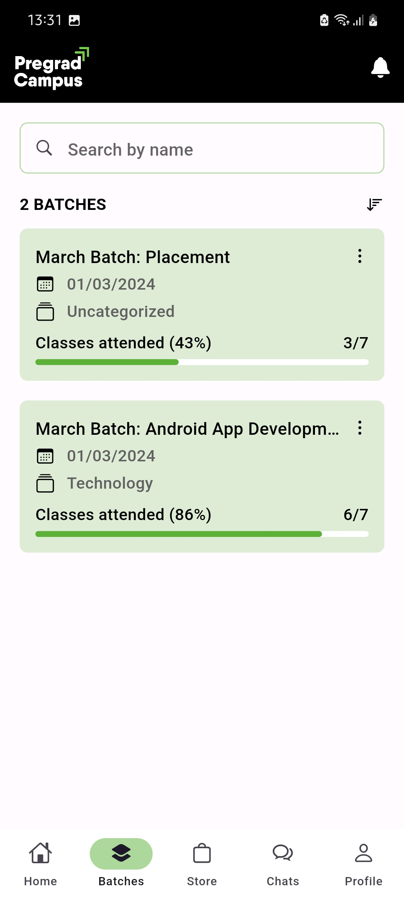

# Pregrad Campus App UI Redesign in Flutter
This project is a partial visual redesign of the Pregrad Campus app using Flutter, a popular cross-platform framework for building mobile applications. The goal of this project is to create a visually appealing and user-friendly interface for the Pregrad Campus app.

### Project Structure
 #### The project structure is organized in the following way:

* lib: contains the main Dart code for the application
* pages: contains the different screens for the application
* widgets: contains the various common widgets used throughout the application
* assets: contains any necessary assets used in the application 

### Installation
#### Clone the repository using the following command:
```bash    
git clone https://github.com/iamkartiknayak/pregrad-campus-app-android-redesign.git
```
#### Rename the project directory before running flutter commands
```bash
mv pregrad-campus-app-android-redesign pregrad_campus_app
```
#### Navigate to the project directory:
```bash 
cd pregrad_campus_app
```
#### Install the dependencies:
```bash 
flutter pub get
```
#### Run the application:
```bash 
flutter run
```
### Screenshots

&nbsp;&nbsp;&nbsp;
&nbsp;&nbsp;&nbsp;
&nbsp;&nbsp;&nbsp;
&nbsp;&nbsp;&nbsp;
&nbsp;&nbsp;&nbsp;
<br><br>


### Conclusion
This Pregrad Campus clone is a demonstration of how Flutter can be used to create beautiful and functional user interfaces. The code is open source and can be used as a starting point for your own Flutter projects.
